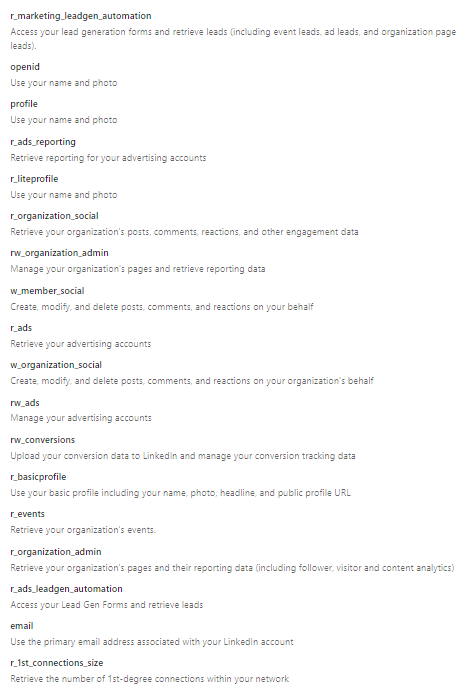
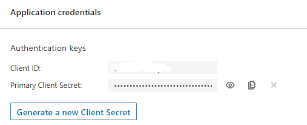
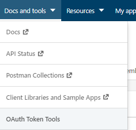

> [!IMPORTANT]
> Antes de iniciar - lembre-se que o acesso e uso do app linkedin se trata de uma solução oficial, você deve criar um app e solicitar as permissões para ter acesso legal aos end points etc.

# Criando um app linkedin
https://www.linkedin.com/developers/apps

Após a criação deve solicitar permissões as apis, vou colocar abaixo quais utilizo, lembrando, são várias, algumas liberadas para empresas etc, mediante comprovação de necessidade e outras apenas para governo. Abaixo as que eu tenho acesso - levou cerca de 2 a 3 dias para eles responderem.

Com tudo liberado, será necessário gerar as chaves.

Lembre-se de gerar o token do usuário.

-----

**Ao clonar é simples, basta instalar os pacotes: npm install**

**O arquivo temas.json deve ser preenchido conforme seu prompt de uso, com suas regras e assuntos desejados. Ele sempre vai gerar conforme a data 'vencida'. basta rodar 'node index.js' para executar**

**Uma dica importante - para fins de testes e usar manualmente sem que seja um app publicado para que todos tenham acesso não é necessário solicitar liberação - eu mesmo antes de pedir acessos usei em modo test.**

**Neste exemplo, pode ter acesso ao endpoint /add para criar novos posts - basta passar o json com data e hora (dd/mm/yyyy hh:mm), assunto e prompt.**

**Se você rodar em um servidor, ele vai ser executado a cada 1 hora para novas postagens.**

*E por último após tudo isto, criar .env com as chaves obtidas.*

> .env

// Os dados abaixo se referem ao app gerado no linkedin
CLIENT_ID=???
CLIENT_SECRET=???
LINKEDIN_USER_ID=???

// Após gerar o token final do usuário deve ser colocado aqui
ACCESS_TOKEN=???

// Aqui é básico, precisa ter chave do GTP
CHAVE_GPT=??